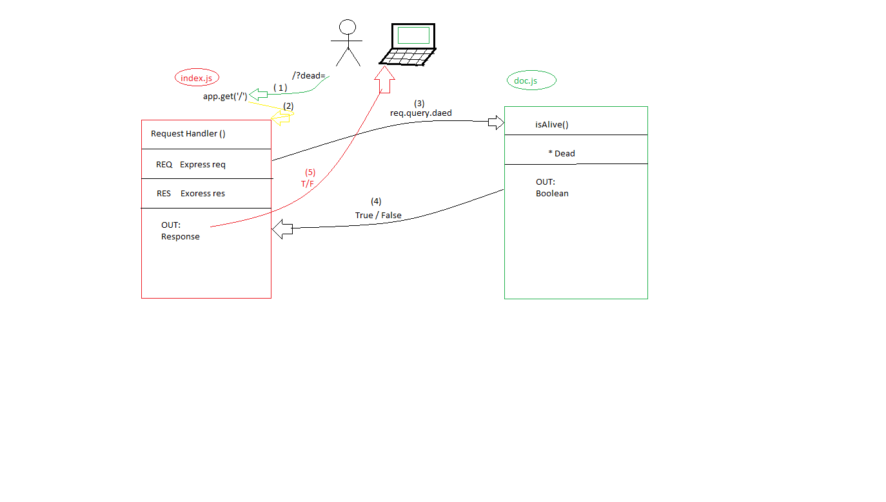

# LAB - 00

## Proof og life server 

### Author: Israa Othman

### Links and Resources

- [submission PR](https://github.com/401-advanced-javascript-israaOthman/deploymentWorkshop-lab00/pull/2)
- [ci/cd](https://travis-ci.com/github/401-advanced-javascript-israaOthman/deploymentWorkshop-lab00) (Travis CI)
- [front-end application](https://d-workshop-lab00-401.herokuapp.com/) (when applicable)

#### Documentation 
- [jsdoc](https://d-workshop-lab00-401.herokuapp.com/docs/)

### Modules 
#### 'pos.js'
##### Exported Values and Methods 

###### 'isAlive(dead) -> boolean
Return true/false to indicate how the server works 

### Setup

#### `.env` requirements

- `PORT` - 3000

#### How to initialize/run your application

- `npm start`
- Endpoint: `/`
    - Returns a boolean 
- Endpoint: `/docs`
    - Returns JsDoc Documentation pages  

#### How to use your library

#### Tests

- How do you run tests? 
   - Unit Tests : `npm test`
   - Limit Tests : `npm run limit`
- Any tests of note? 
    - I faced a problem when I tried to run this command `npm run jsdoc`   
      and when I searched about it I found that I should install `npm install -g jsdoc`  
      before .... this wasn't in the tutorial 
- Describe any tests that you did not complete, skipped, etc
    - every thing is completed 

#### UML
